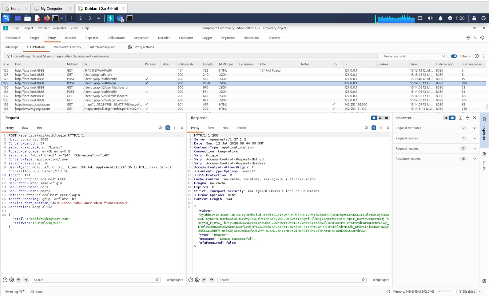
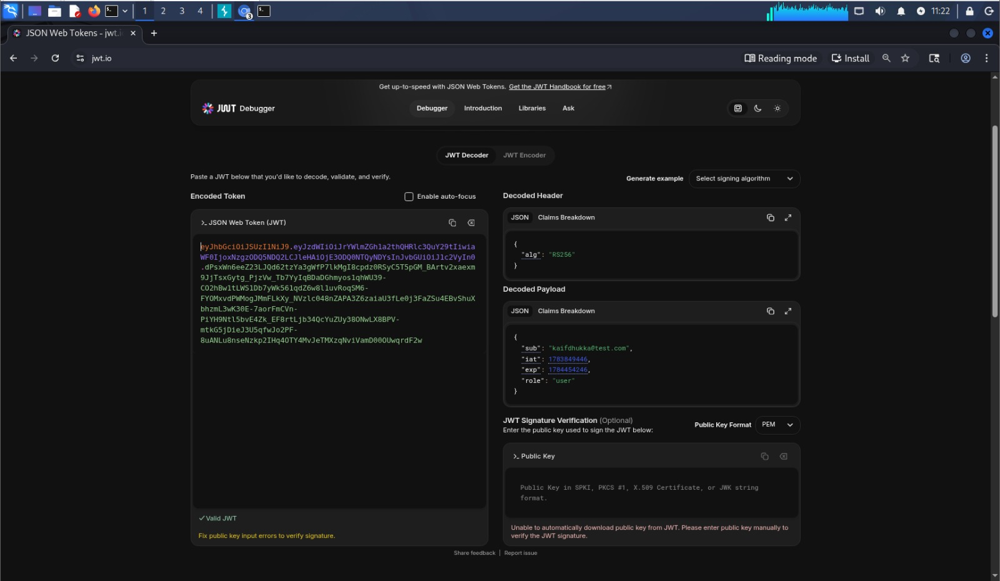
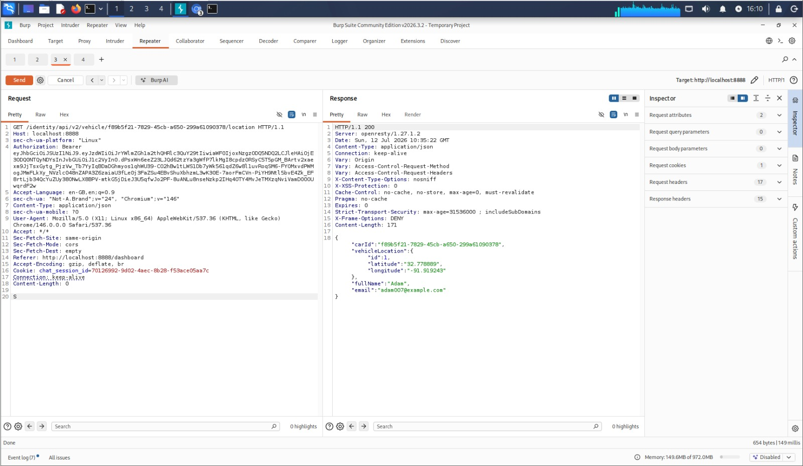
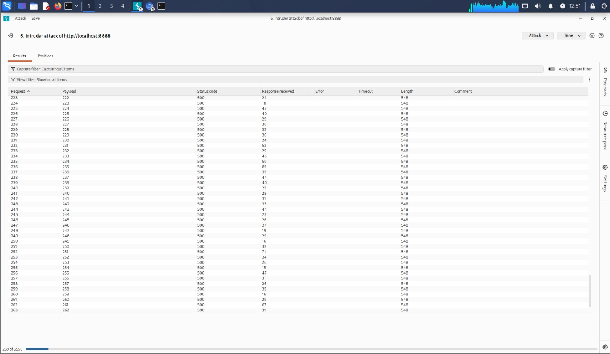
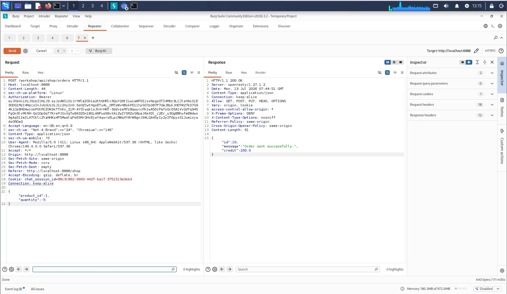
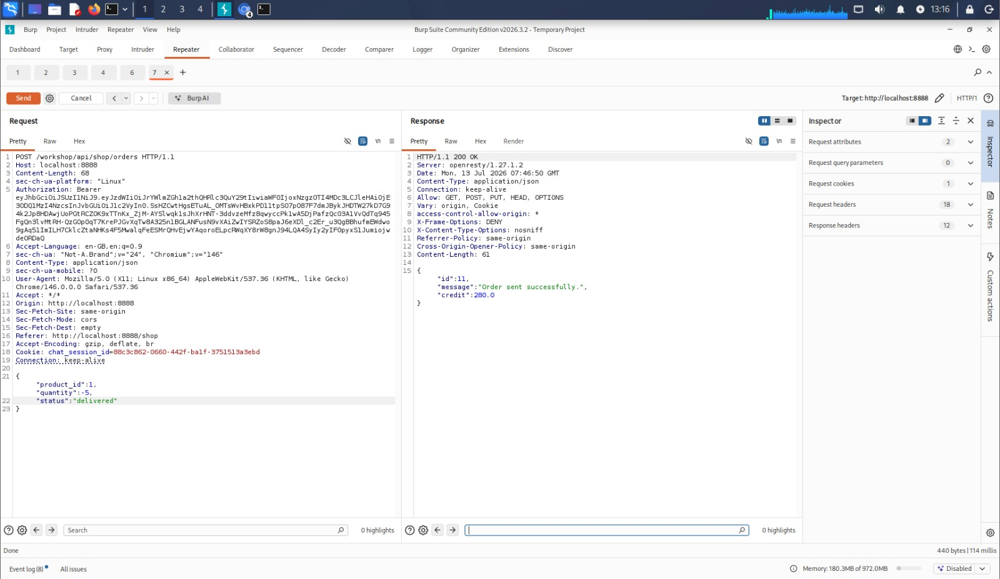

# API Security Assessment & Vulnerability Analysis (crAPI)

## Project Overview

This repository documents a manual API security assessment performed against the **crAPI (Completely Ridiculous API)** application using **Burp Suite Community Edition**. The assessment focused on understanding API functionality, analyzing authentication mechanisms, evaluating authorization controls, testing business logic, and identifying input validation weaknesses in a controlled lab environment.

---

# Objectives

- Perform API reconnaissance and endpoint discovery
- Analyze authentication and JWT-based authorization
- Test API endpoints for authorization weaknesses
- Evaluate server-side input validation
- Assess business logic implementation
- Document findings with proof-of-concept evidence and remediation recommendations

---

# Lab Environment

| Component | Details |
|-----------|---------|
| Operating System | Kali Linux |
| Target Application | crAPI (Docker) |
| Proxy Tool | Burp Suite Community Edition |
| Host Platform | VMware Workstation |

---

# Tools Used

- Burp Suite Community Edition
- Docker
- JWT.io
- Firefox Browser
- Kali Linux

---

# Testing Methodology

```
Reconnaissance
      ↓
Traffic Interception
      ↓
Authentication Analysis
      ↓
JWT Analysis
      ↓
Authorization Testing
      ↓
Business Logic Testing
      ↓
Input Validation Testing
      ↓
Reporting
```

---

# Assessment Activities

## 1. API Reconnaissance

- Intercepted API traffic using Burp Suite Proxy.
- Identified REST API endpoints exposed by the application.
- Mapped request methods, parameters, headers, and response structures.

**Evidence**



---

## 2. JWT Token Analysis

- Captured authentication tokens after user login.
- Decoded JWT tokens using JWT.io.
- Reviewed token header, payload, signing algorithm (RS256), and user claims.

**Evidence**



---

## 3. Authorization Testing (BOLA / IDOR)

- Performed authorization testing by modifying object identifiers in API requests using Burp Repeater.
- Evaluated whether API endpoints enforced appropriate server-side authorization controls.

**Evidence**



---

## 4. Authentication Error Handling

- Tested authentication-related endpoints using modified request data.
- Observed application responses to evaluate server-side validation and error handling.
- HTTP 500 Internal Server Error responses were observed during testing.

**Evidence**



---

## 5. Business Logic Testing

The order creation endpoint was tested by modifying the request body.

Original request:

```json
{
    "product_id": 1,
    "quantity": 1
}
```

Modified request:

```json
{
    "product_id": 1,
    "quantity": -5
}
```

The server processed the modified request successfully and returned **HTTP 200 OK**, indicating that negative quantity values were not rejected during server-side validation.

**Evidence**



---

## 6. Input Validation Testing

Additional JSON properties were manually added to API requests to evaluate how the application handled unexpected client-supplied parameters.

Example:

```json
{
    "product_id": 1,
    "quantity": 1,
    "status": "delivered"
}
```

The modified request was processed successfully during testing.

**Evidence**



---

# Key Findings

| Finding | Severity | Status |
|----------|----------|--------|
| API Reconnaissance | Informational | Completed |
| JWT Token Analysis | Informational | Completed |
| Authorization Testing | Medium | Performed |
| Authentication Error Handling | Low | Observed |
| Negative Quantity Validation | High | Confirmed |
| Input Validation Testing | Medium | Observed |

---

# Remediation Recommendations

- Implement strict server-side validation for all numeric input fields.
- Reject invalid values such as negative quantities before processing requests.
- Validate and whitelist expected JSON properties.
- Return standardized client error responses (4xx) instead of exposing internal server errors.
- Enforce authorization checks for every object reference requested by clients.

---

# Skills Demonstrated

- API Security Testing
- Burp Suite Proxy
- Burp Suite Repeater
- REST API Assessment
- JWT Analysis
- HTTP Request Manipulation
- Authorization Testing
- Business Logic Testing
- Input Validation Testing
- Technical Documentation
- Vulnerability Reporting

---

# Disclaimer

This assessment was performed in a controlled laboratory environment using the intentionally vulnerable **crAPI** application for educational and defensive security purposes only.
